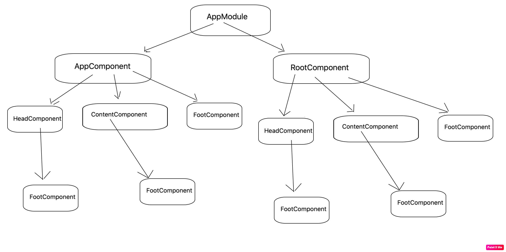

## 什么是angular module(ngModule)?
**angular module就是一个普通的类，但是这个类，一旦被@NgModule所装饰，那这个类就可以被称为angular module**

## @NgModule元数据
> [@NgModule](https://angular.cn/api/core/NgModule) 获取一个元数据对象，它会告诉 Angular 如何编译和启动本应用

- declarations —— 该模块的依赖项。
- imports —— 导入其他的ngModule。
- providers —— 提供各种服务。
- bootstrap —— 根组件，Angular 创建它并插入 index.html 宿主页面

## declarations 数组
**该模块想要正常工作，可能会依赖一些组件、指令和管道，那就必须将它们声明到declarations中，不过引入也有一些规则，以组件为例：**
- 模块中不能使用未声明过（没有添加到declarations中）的组件
- 一个组件只能被一个模块声明
- 在declarations中的组件默认只能在当前模块中使用，要想让其他模块使用，必须exports出去（参考下文的exports）
 
以上规则同样适用于指令和管道

## imports 数组
imports数组只会出现在@NgModule装饰器中，一个模块想要正常工作，除了本身的依赖项(declarations)，还可能需要其他模块导出的依赖项。
只要是angular module，都可以导入imports数组中，比如自定义的模块，第三方或者ng内置的都可以

## providers 数组
该数组提供一系列服务

## bootstrap 数组
应用是通过引导根模块 AppModule 来启动的，引导过程还会创建 bootstrap 数组中列出的组件，并把它们逐个插入到浏览器的 DOM 中。
该数组中的每个组件，都作为组件树的根（根组件），后续所有组件都是基于根组件的(如图)。
虽然也可以在宿主页面中放多个组件，但是大多数应用只有一个组件树，并且只从一个根组件开始引导。
这个根组件通常叫做 AppComponent，并且位于根模块的 bootstrap 数组中。

