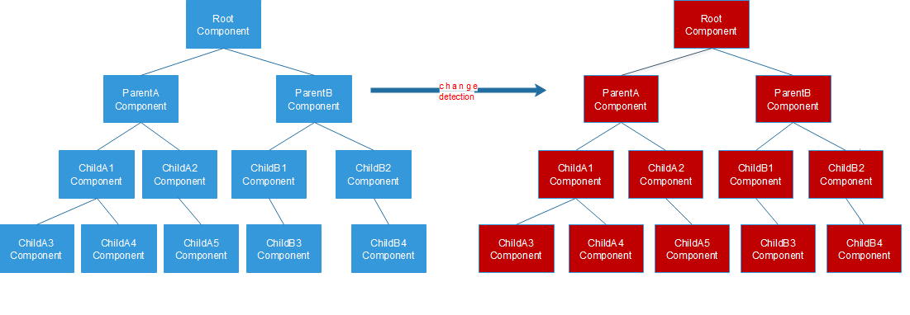

## 触发变更检测的时机
- 事件：页面 click、submit、mouse down……
- XHR：从后端服务器拿到数据
- Timers：setTimeout()、setInterval()

## 单向数据流
假设其中某个组件中触发的变更检测，就会从根组件开始，从上至下，挨个检测一遍，直到最后一级组件全部检测完毕
 
已经检测完的组件，不允许在被子组件修改，这就是单向数据流

## onPush策略下触发变更检测的时机
> 定时器已无法触发变更检测了
- 组件的@Input引用发生变化。
- 组件的 DOM 事件，包括它子组件的 DOM 事件，比如 click、submit、mouse down。
- Observable 订阅事件，同时设置 Async pipe。
- 手动使用ChangeDetectorRef.detectChanges()、ChangeDetectorRef.markForCheck()、ApplicationRef.tick()方法

阻断了一个组件的变更检测后，他和他的子组件都不会检测了

